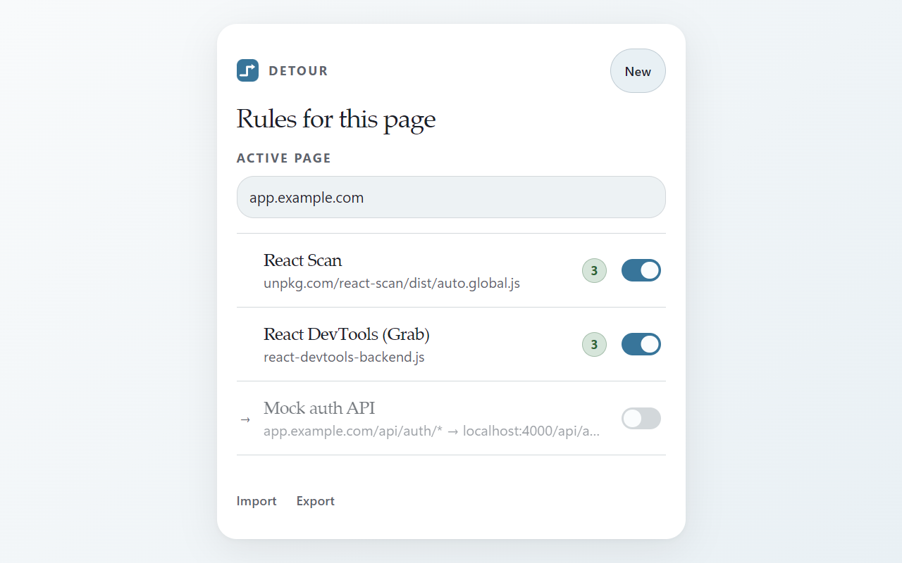

# 🔀 Detour

**Redirect requests. Inject scripts. Bypass CSP. All from a browser extension.**

The missing dev tool between your browser and localhost. Point any API at your local server, inject a script into a live page, or strip CORS headers — without touching production code.

<p align="center">
  
</p>

<p align="center">
  <a href="https://chromewebstore.google.com/detail/detour/cinkplogkjggmgdkaflhlemcdhchninp"></a>
  
  
  
</p>

## Install

**[→ Chrome Web Store](https://chromewebstore.google.com/detail/detour/cinkplogkjggmgdkaflhlemcdhchninp)** — one click, works in Chrome, Edge, Brave, Arc, and any Chromium browser.

## What It Does

### 🔀 Redirect Rules
Route any URL to localhost, staging, or a mock — with wildcards and capture groups:

```
https://app.example.com/api/*  →  http://localhost:4000/api/$1
```

Redirects work at **both** the network level (`declarativeNetRequest`) and in-page (patches `fetch`/`XHR`), so nothing slips through.

### 💉 Script Injection
Load external JavaScript into any page **before** the page's own code runs. Bypasses Content Security Policy — the extension injects with its own privileges, so strict CSP sites work fine.

### ⚡ One-Click Header Overrides
- **Allow CORS** — no more `Access-Control-Allow-Origin` errors
- **Disable CSP** — test scripts on locked-down pages
- **Disable X-Frame-Options** — embed any page in an iframe

## Use Cases

- **Frontend dev**: Point `api.prod.com/v2/*` at `localhost:3001/$1` while keeping the prod UI
- **Script experiments**: Inject a tracing library or dev overlay into a live site without rebuilding
- **CORS debugging**: One-click CORS allow instead of configuring server headers
- **Testing**: Swap a CDN script for a local build to test a fix before deploying
- **Demos**: Reroute API calls to mock data for a presentation

## Rule Format

Rules are stored as JSON — import/export with VS Code autocomplete via the bundled schema:

```json
{
  "$schema": "https://raw.githubusercontent.com/amitse/detour/main/rules.schema.json",
  "rules": [
    {
      "id": "mock-auth",
      "name": "Mock auth API",
      "type": "redirect",
      "enabled": true,
      "source": { "operator": "wildcard", "value": "https://app.example.com/api/auth/*" },
      "destination": "http://localhost:4000/api/auth/$1"
    }
  ]
}
```

Pattern matching: `wildcard` (default), `contains`, `equals`, or `regex`. Capture groups with `$1`, `$2`, etc.

## Architecture

```
popup.html / popup.js      — Rule list + editor UI
service-worker.js          — Storage, DNR sync, script injection
loader.js                  — Passes redirect rules to page context
page-script.js             — Patches fetch/XHR before app code runs
```

**Redirect flow:** `loader.js` reads rules → sets `window.__REQUEST_RULES_REDIRECTS__` → `page-script.js` patches `fetch`/`XHR` at call-time. The service worker also registers `declarativeNetRequest` rules for network-level coverage.

**Script injection:** Service worker listens to `webNavigation.onCommitted` → fetches script text (cached 5min) → injects via `chrome.scripting.executeScript({ world: "MAIN" })`, bypassing CSP.

## Build from Source

<details>
<summary>Load unpacked or build for Chrome Web Store</summary>

**Unpacked (dev):**
1. Open `chrome://extensions`, enable Developer mode
2. Click "Load unpacked" and select this folder

**Chrome Web Store zip:**
```bash
npm install sharp
node scripts/build.js              # build with current version
node scripts/build.js --bump patch # bump version and build
```

Regenerates PNG icons from `icon.svg` and packages into `detour-<version>.zip`.

</details>

## Privacy

Everything runs in your browser. No account, no telemetry, no remote configuration. Rules stay on your machine until you export them.

## License

[MIT](LICENSE)
